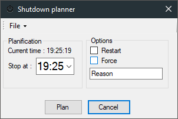

# Shutdown planner

 

A simple windows shutdown planner.

## 1. Getting started
### 1.1 Prerequisites
- Visual studio

### 1.2 How to use it
Download a [release](https://github.com/N3ROO/ShutdownPlanner/releases), and execute it.

### 1.3 Setting up your dev environment
Open the project with visual studio.

## 2. Miscellaneous
### 2.1 Changelog
The changelog is available [here](CHANGELOG.md).

### 2.2 Authors
- **N3ROO** - *Initial work* - [Github](https://github.com/N3ROO) [Website](https://n3roo.github.io/)

### 2.3 License
This project is licensed under the GPL-3.0 license - see the [LICENSE](LICENSE.md) file for details